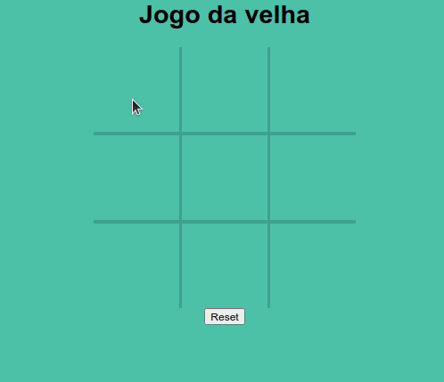

<h1 align="center">
 
  
 
 
Jogo da Velha
</h1>

Um jogo da velha feito em js.

  

[//]: # (Add your gifs/images here:)

  

## Instalação

Apenas clone o repositório e abra o arquivo index.html em um navegador ;D

## Licença

This project is licensed under the MIT License - see the [LICENSE](https://opensource.org/licenses/MIT) page for details.